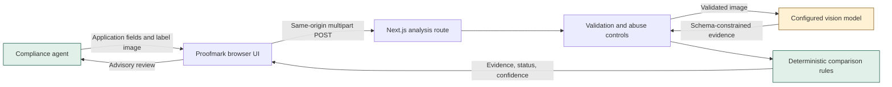
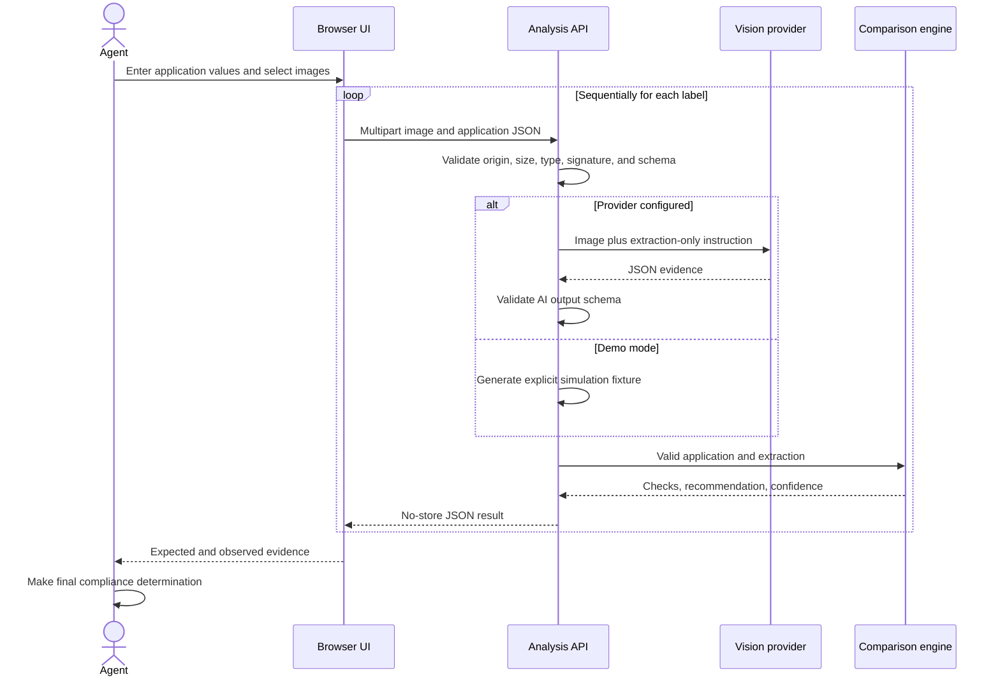

# Architecture

## Purpose

Proofmark is a standalone proof of concept that helps a TTB compliance agent compare alcohol label artwork with application data. AI extracts visible evidence; deterministic code performs comparisons; the agent retains decision authority.

## Context

## Runtime components

| Component | Responsibility | Trust level |
|---|---|---|
| Browser workspace | Collect fields and files, maintain a local queue, display evidence | Untrusted client |
| `POST /api/analyze` | Enforce request limits, validate inputs, call extraction adapter | Server trust boundary |
| Vision provider adapter | Extract visible label fields into JSON | Untrusted probabilistic output |
| Zod schemas | Reject malformed application and model output | Deterministic control |
| Comparison engine | Normalize fields, check statutory warning, assign recommendation | Authoritative application logic |
| Compliance agent | Inspect evidence and make final determination | Human decision authority |

## Request sequence

## Trust boundaries and data handling

1. Browser input is untrusted. The server repeats validation and does not rely on client checks.
2. Label text is untrusted content. The model is told not to follow instructions found in the image.
3. Model output is untrusted. It must pass a closed Zod schema before comparison.
4. Uploaded bytes exist in browser memory and server request memory. The application has no database or upload store.
5. A configured provider receives the image. Production use therefore requires an approved endpoint, retention terms, encryption, and network controls.

## Deployment view

The prototype runs as one Node.js Next.js service. A production design should place authenticated users behind an agency identity-aware gateway, submit malware-scanned files to encrypted temporary object storage, enqueue analysis, process with bounded workers, connect to an approved private model endpoint, and emit metadata-only audit events. This asynchronous topology is required for the stakeholder's 200-300 file batches; it is intentionally not simulated by the prototype.

## Key decisions

- [ADR-001: Deterministic compliance rules](adr/001-deterministic-compliance-rules.md)
- [ADR-002: Server-side AI inference](adr/002-server-side-ai-inference.md)
- [ADR-003: Human decision authority](adr/003-human-decision-authority.md)
