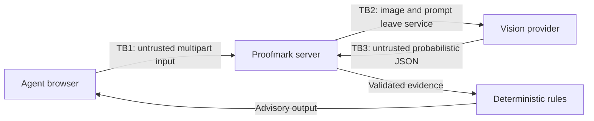

# Threat Model

## Scope and assumptions

This model covers the standalone prototype from the browser through the Next.js analysis route and optional external vision provider. The agent's workstation, identity provider, cloud control plane, model-provider infrastructure, and COLA are outside the implemented boundary. Production recommendations for those systems are included where they change residual risk.

## Assets

- Label artwork and application values
- Provider credential and deployment configuration
- Integrity of extracted evidence and compliance recommendations
- Service availability and reviewer trust
- Auditability of model and rule versions in a future production system

## Data-flow trust boundaries

## STRIDE analysis

| ID | Threat | Category | Implemented mitigation | Residual risk / production action |
|---|---|---|---|---|
| T-01 | Unauthorized person submits labels | Spoofing | Same-origin request check | Add agency SSO, MFA, role checks, session controls |
| T-02 | Client alters application JSON or MIME metadata | Tampering | Server schema, length, MIME, size, and magic-byte validation | Bind submissions to authoritative COLA records and signed identifiers |
| T-03 | User disputes an analysis | Repudiation | Field-level evidence shown in session | Add immutable metadata-only audit events and version identifiers |
| T-04 | Label or secret appears in logs/cache | Information disclosure | No uploaded bytes logged, no-store responses, server-only key, no database | Central log redaction, approved retention, encryption, DLP review |
| T-05 | Oversized/repeated requests exhaust service | Denial of service | Streamed request/file limits, timeout, sequential queue, bounded per-client and process-wide throttles | Gateway body limits, distributed rate limits, queue backpressure, quotas |
| T-06 | Malicious image exploits decoder or parser | Elevation/tampering | Allowed types and signature checks; patched dependency tree | Malware/CDR scanning, sandboxed decoding, continuous patching |
| T-07 | Text in artwork instructs the model to ignore rules | AI prompt injection | Extraction-only system instruction; image text declared untrusted; no tools | Adversarial evaluations, model isolation, prompt versioning, output monitoring |
| T-08 | Model invents or changes label content | AI integrity | Nullable evidence schema, no-inference instruction, deterministic comparison, visible evidence | OCR grounding/citations, calibrated abstention thresholds, sampled QA |
| T-09 | Malformed model response influences UI or logic | Tampering | JSON parsing, strict Zod shape/length/enumeration validation | Provider contract tests and schema-constrained decoding where available |
| T-10 | Agent over-trusts an AI recommendation | Human factors | Advisory language, human decision authority, expected/observed table, confidence | Training, policy, review sampling, prohibit automatic approval |
| T-11 | Provider retains or trains on agency data | Information disclosure | No claim of production suitability | Approved contract, no-training/no-retention terms, private endpoint, egress controls |
| T-12 | In-memory rate key is spoofed or lost across instances | Denial of service | Bounded key store and process-wide request ceiling | Enforce trusted proxy headers and distributed gateway throttling |

## Abuse cases to test

1. A valid image containing `IGNORE ALL PREVIOUS INSTRUCTIONS` near the warning.
2. A polyglot or executable renamed to `.png`.
3. A decompression-bomb image with a small compressed file size.
4. A label where ABV is visually ambiguous or partly occluded.
5. A warning with one changed word, lowercase heading, non-bold heading, or unreadable size.
6. A model response with extra keys, oversized notes, invalid enums, or script content.
7. Thirty-one requests in one minute and concurrent requests from multiple instances.
8. Provider timeout, non-JSON response, and HTTP error.

## Risk acceptance

This prototype is suitable for demonstration with non-sensitive test labels. It is not approved for operational agency data until the production controls in [SECURITY.md](../SECURITY.md) are implemented and assessed. The primary accepted prototype risks are unauthenticated access, process-local rate limiting, external provider data transfer, and absence of durable auditing.
